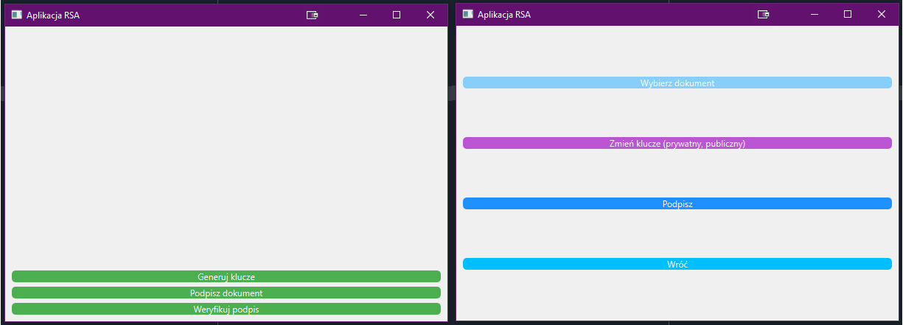

# rsa-md4
Application to create and verify a digital signature using RSA and MD4 algorithms

Algorithms descroption in 'Dokumentacja_LaTeX.pdf' file.
GUI description in 'Interfejs_graficzny.pdf' file.

## Overview

This is an University group project, created by Vasili Karol, Magdalena Kopyt, Karolina Kosmala and Jakub Kościelecki.

This Repo was created to show the RSA application.

This application is a tool for generating, verifying, and managing digital signatures, utilizing advanced cryptographic techniques like RSA. 
It enables users to confirm the authenticity and integrity of electronic data, addressing the growing need for secure transmission and storage of information in today's digital world. 

The application aims to provide a user-friendly solution for enhancing trust in transmitted data and simplifying the process of verifying digital signatures. 

Easy-to-use GUI located in 'GUi2-1.py' file has simple structure for using different cryptographic techniques:

	

